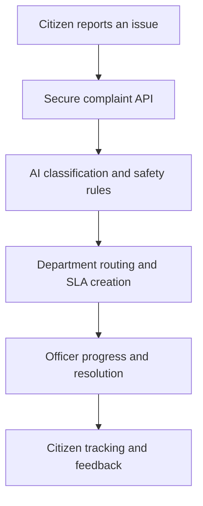
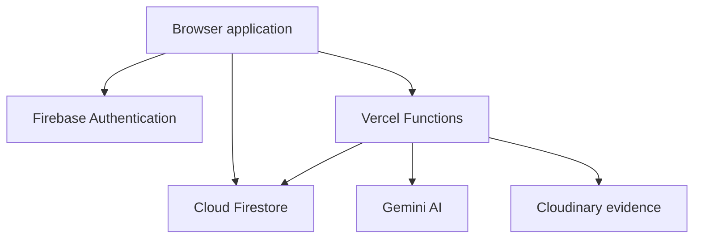

<div align="center">

# CivicResolve AI

### AI-Powered Civic Complaint Management and Resolution Platform

CivicResolve AI helps citizens report civic issues and enables municipal teams to classify, route, track and resolve them through one secure, transparent workflow.

[](https://civicresolve-ai-beta.vercel.app/)
[](#testing)
[](#roadmap)

[Live Demo](https://civicresolve-ai-beta.vercel.app/) · [Features](#key-features) · [Architecture](#system-architecture) · [Setup](#run-locally) · [Documentation](#documentation)

</div>

## Overview

Citizens often struggle to identify the correct department, understand complaint priority and track whether a civic issue will be resolved on time. Municipal teams, meanwhile, need reliable evidence, location data, role-based access and clear accountability.

CivicResolve AI brings these needs together in a single public grievance platform. It combines secure complaint submission, Gemini-assisted classification, deterministic safety rules, department routing, map-based reporting, evidence handling, SLA monitoring and real-time role-specific dashboards.

> Developed as a practical civic-technology solution for the VSB Hackathon.

## Key features

### Citizen experience

- Register with email/password or Google and recover access through password reset.
- Submit a complaint with a title, description, category, exact map location and up to three image or PDF evidence files.
- Select a location through address search, device location or a draggable Leaflet map pin.
- Receive a unique grievance ID and follow the complete status timeline in real time.
- View SLA deadlines, due-soon warnings and overdue states.
- Receive possible duplicate warnings and provide a rating and feedback after resolution.
- Use a responsive, accessible interface with light and dark themes.

### AI-assisted routing

- Classifies complaints with Gemini into approved civic categories.
- Predicts priority and routes each complaint to the correct department.
- Returns confidence, reasoning and review signals for transparent decision support.
- Applies deterministic safety rules that can raise urgent complaints to High priority.
- Falls back to local routing rules when the AI provider is unavailable or unconfigured.
- Excludes account details, exact coordinates and evidence from AI requests.

### Officer and administrator operations

- Provides real-time dashboards scoped to citizen, department-officer and administrator roles.
- Displays authorised complaints on an operational map with status or priority colours.
- Supports search and filters for category, department, status, priority and SLA state.
- Groups nearby map pins to reveal small civic-problem hotspots.
- Allows authorised officials to update status, add progress notes and maintain an auditable history.
- Gives administrators complaint analytics, role management and department assignment controls.
- Records append-only role changes and protects legacy complaints without map coordinates.

### Evidence, security and accountability

- Stores complaint data in Cloud Firestore using least-privilege security rules.
- Keeps evidence private as authenticated Cloudinary assets rather than public URLs.
- Verifies file type, signature and size before upload; each file is limited to 5 MB.
- Generates five-minute signed links only after Firebase authorisation.
- Creates immutable, priority-aware SLA policy snapshots using server timestamps.
- Runs a protected daily SLA monitor for due-soon and overdue state transitions.

## User roles

| Capability | Citizen | Department officer | Administrator |
|---|:---:|:---:|:---:|
| Submit and track a complaint | Own complaints | — | — |
| Upload initial evidence | Own complaints | — | — |
| View evidence | Own complaints | Assigned department | All complaints |
| Update status and progress notes | — | Assigned department | All complaints |
| Change priority or department | — | — | Yes |
| View operational analytics | — | Department scope | All departments |
| Manage user roles | — | — | Yes |

## Complaint workflow



## System architecture



The frontend is build-free HTML, CSS and browser JavaScript. Sensitive actions run through Node.js Vercel Functions, while Firebase Authentication and Firestore provide identity, real-time data and role-scoped access.

## Technology stack

| Layer | Technologies |
|---|---|
| Frontend | HTML5, CSS3, JavaScript |
| Maps | Leaflet 1.9.4, OpenStreetMap, Nominatim |
| Authentication and data | Firebase Authentication, Cloud Firestore |
| AI classification | Google Gemini with deterministic fallback rules |
| Server APIs | Node.js 20, Vercel Functions |
| Evidence | Cloudinary authenticated assets |
| Deployment | Vercel |
| Testing | Node.js contract and regression test suites |

## Project structure

```text
civicresolve-ai/
├── api/                  # Vercel API routes and daily SLA cron endpoint
├── assets/
│   ├── css/              # Shared, authentication and Version 2 styles
│   ├── js/               # UI, auth, data, map, AI, SLA and evidence modules
│   └── vendor/leaflet/   # Vendored Leaflet runtime and licence
├── docs/                 # Architecture and provider setup guides
├── server/               # Secure reusable server-side services
├── tests/                # 14 automated contract and regression suites
├── firestore.rules       # Role-aware Firestore security contract
├── index.html            # Application entry point
├── package.json
└── vercel.json
```

## Run locally

### Prerequisites

- Node.js 20 or later
- npm
- Python 3 for a simple static preview

### Installation

```bash
git clone https://github.com/Nithish-code17/civicresolve-ai.git
cd civicresolve-ai
npm install
python -m http.server 5500
```

Open `http://localhost:5500` in your browser.

The static preview is suitable for interface testing. AI classification, secure complaint creation, evidence operations and the SLA monitor require their server-side environment variables in Vercel or an equivalent local server environment.

## Environment configuration

Copy the variable names from `.env.example` and store real values only in your secure deployment environment.

| Variable | Purpose |
|---|---|
| `CLOUDINARY_CLOUD_NAME` | Cloudinary account identifier |
| `CLOUDINARY_API_KEY` | Server-side Cloudinary API access |
| `CLOUDINARY_API_SECRET` | Server-side Cloudinary signing secret |
| `FIREBASE_PROJECT_ID` | Firebase project used by server APIs |
| `GEMINI_API_KEY` | Server-side Gemini authentication |
| `GEMINI_MODEL` | Configurable Gemini model name |
| `CRON_SECRET` | Protects the scheduled SLA endpoint |
| `FIREBASE_ADMIN_CLIENT_EMAIL` | Firebase service-account identity |
| `FIREBASE_ADMIN_PRIVATE_KEY` | Firebase service-account private key |

Never commit a populated environment file, service-account JSON, private key or provider secret.

## Testing

Run the complete automated test gate:

```bash
npm test
npm audit --omit=dev
```

The 14 suites cover classification rules, Gemini handling, complaint creation, Firestore data access, map reporting, role accounts, evidence APIs, SLA behaviour, security rules and core interface contracts.

## Documentation

- [`docs/ARCHITECTURE.md`](docs/ARCHITECTURE.md) — application architecture and data strategy
- [`docs/FIREBASE_SETUP.md`](docs/FIREBASE_SETUP.md) — authentication, Firestore and role setup
- [`docs/AI_CLASSIFICATION_SETUP.md`](docs/AI_CLASSIFICATION_SETUP.md) — Gemini configuration and privacy controls
- [`docs/EVIDENCE_SETUP.md`](docs/EVIDENCE_SETUP.md) — secure evidence provider setup
- [`docs/SLA_SETUP.md`](docs/SLA_SETUP.md) — SLA policy and scheduled monitor setup
- [`docs/ENHANCEMENT_ROADMAP.md`](docs/ENHANCEMENT_ROADMAP.md) — planned product improvements

## Roadmap

- Location-aware intelligent duplicate detection and support counts
- Individual officer assignment with workload visibility
- Before-and-after resolution evidence
- Citizen resolution approval, reopening and automatic escalation
- Department performance reports with CSV and PDF exports
- Tamil and English language support
- Optional email, SMS and WhatsApp notifications

## Author

Developed by [Nithish Sarwin](https://github.com/Nithish-code17).
